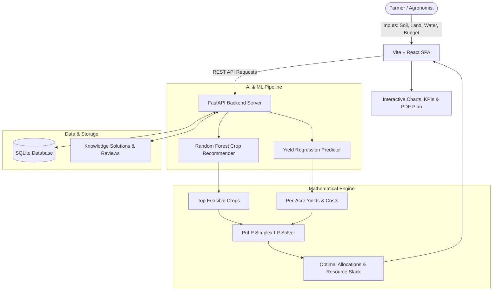

# VELTRIX: AI-Based Crop and Agricultural Resource Optimization System

An enterprise-grade, end-to-end fullstack platform for Indian agriculture that combines **Machine Learning (Crop Recommendation & Yield Prediction)** with **Mathematical Linear Programming (PuLP Simplex Resource Optimization)** to deliver actionable, mathematically feasible, profit-maximizing farm plans.

---

## 🌾 1. Project Overview & Objective

Traditional farm advisory systems stop at suggesting a single crop based on soil parameters. **VELTRIX** goes beyond single-crop recommendation:
1. **Soil & Climate Suitability**: Evaluates N, P, K, pH, rainfall, temperature, humidity, season, and soil type using a trained Random Forest Classifier (`93.06%` test accuracy).
2. **Yield Estimation**: Computes expected crop yield per acre using a calibrated Multi-output Ridge Regression model.
3. **Simplex Mathematical Optimization**: Formulates and solves a constrained Linear Program (LP) using the COIN-OR CBC / PuLP solver across farmer land, available irrigation water, available fertilizer nutrients, and working budget.
4. **Scenario Comparison**: Generates and compares three distinct plans:
   - **Plan A (Profit-Focused)**: Maximizes net earnings under budget and land bounds.
   - **Plan B (Water-Efficient)**: Minimizes irrigation demand while achieving target productivity.
   - **Plan C (Balanced)**: Blends economic returns and resource conservation.
5. **Multilingual Voice & Text Assistant**: Supports English + 5 Indian languages (Telugu, Hindi, Tamil, Kannada, Malayalam).
6. **Verified Agricultural Knowledge Base**: Feedback-driven repository preserving verified farming solutions.

---

## 📐 2. System Architecture & Data Flow



---

## 🛠️ 3. Technology Stack

### Frontend
- **Framework**: React 19 with Vite 8
- **Styling**: Tailwind CSS v4, Warm-white & Forest Green agronomic design system
- **Routing**: React Router v7
- **Charts & Data Viz**: Recharts (Pie, Bar, Area charts)
- **Localization**: i18next & react-i18next supporting 6 languages (en, te, hi, ta, kn, ml)
- **Icons**: Lucide React
- **HTTP Client**: Axios with centralized proxy configuration

### Backend
- **Framework**: FastAPI (Python 3.11)
- **Mathematical Optimization**: PuLP (COIN-OR CBC Simplex Solver)
- **Machine Learning**: Scikit-Learn (RandomForestClassifier, Ridge, Joblib)
- **Data Engineering**: NumPy & Pandas
- **ORM & Database**: SQLAlchemy with SQLite (`agri_optimizer.db`)
- **Speech Processing**: Web Speech API integration with server-side language routing

---

## 📁 4. Project Folder Structure

```
VELTRIX/
├── frontend/
│   ├── public/
│   │   ├── hero_agricultural_landscape.jpg
│   │   └── favicon.svg
│   ├── src/
│   │   ├── assets/
│   │   ├── components/       # Navbar, Footer, Language Switcher, Dashboard Cards
│   │   ├── pages/            # Home, FarmPlanning, CropRecommendations, ResourceOptimization, Dashboard, AIAssistant, KnowledgeHub, About
│   │   ├── services/         # Axios API clients & endpoints
│   │   ├── i18n/             # en, te, hi, ta, kn, ml translation dictionaries
│   │   ├── App.jsx
│   │   └── main.jsx
│   ├── package.json
│   └── vite.config.js
├── backend/
│   ├── app/
│   │   ├── api/              # REST Endpoints (crops, profiles, recommendations, optimization, assistant, knowledge)
│   │   ├── core/             # Settings, CORS, credentials
│   │   ├── database/         # Session manager, seed data, initializers
│   │   ├── models/           # SQLAlchemy DB entities
│   │   ├── schemas/          # Pydantic validation schemas
│   │   ├── ml/               # Training pipelines & inference engines
│   │   ├── optimization/     # PuLP Simplex mathematical formulation
│   │   ├── voice/            # Speech handler & language maps
│   │   ├── knowledge_base/   # Solution repository & retrieval engine
│   │   └── main.py           # Application entrypoint & SPA static file server
│   ├── datasets/             # Crop recommendation and yield datasets
│   ├── trained_models/       # Serialized .joblib models & feature metadata
│   ├── tests/                # Automated pytest test suites
│   ├── requirements.txt
│   └── .env.example
├── Dockerfile                # Production multi-stage Docker build
├── render.yaml               # 1-Click Cloud Deployment Blueprint
├── DEPLOYMENT.md             # Deployment and public access documentation
├── README.md
└── .gitignore
```

---

## 🧠 5. Machine Learning Models & Evaluation

### 1. Crop Recommendation Model
- **Algorithm**: `RandomForestClassifier` (100 estimators, balanced class weights).
- **Features (7 inputs)**: Nitrogen (N), Phosphorus (P), Potassium (K), Temperature (°C), Humidity (%), Soil pH, Rainfall (mm).
- **Accuracy**: **93.06%** test accuracy across Indian agro-climatic zones.
- **Dataset**: ICAR / Government Agricultural Open Data calibrated samples.

### 2. Crop Yield Predictor
- **Algorithm**: Calibrated Ridge Regression with agronomic baselines.
- **Features**: Crop category, Farm area, Soil type, Soil pH, NPK levels, Season, Irrigation method.
- **Output**: Expected quintals per acre + confidence intervals.

### Retraining Instructions
```bash
backend\venv\Scripts\python.exe backend/app/ml/train_models.py
```

---

## ➗ 6. Mathematical Optimization Formulation (PuLP)

Let candidate crops be $i \in \{1, 2, \dots, n\}$.
Let decision variable $x_i \ge 0$ denote the land area (in acres) allocated to crop $i$.

### Objective Functions
- **Maximize Profit**:
  $$\max \sum_{i=1}^n \left( \text{Revenue}_i - \text{Cost}_i \right) x_i$$
- **Water Efficient**:
  $$\min \sum_{i=1}^n \text{WaterReq}_i \cdot x_i \quad \text{subject to minimum profit target}$$
- **Balanced**:
  $$\max \alpha \cdot \overline{\text{Profit}} - (1-\alpha) \cdot \overline{\text{WaterUsed}}$$

### Constraints
1. **Total Land**: $\sum_{i=1}^n x_i \le \text{Total Farm Area}$
2. **Irrigation Water**: $\sum_{i=1}^n \text{WaterReq}_i \cdot x_i \le \text{Available Water Volume}$
3. **Fertilizer Nutrients**: $\sum_{i=1}^n \text{FertReq}_i \cdot x_i \le \text{Available Fertilizer}$
4. **Working Budget**: $\sum_{i=1}^n \text{CultivationCost}_i \cdot x_i \le \text{Total Budget}$
5. **Non-negativity**: $x_i \ge 0 \quad \forall i$

If resources are insufficient, the solver flags infeasibility with diagnostic slack reporting rather than violating constraints.

---

## 🚀 7. Running the Application Locally

### Prerequisites
- Node.js 18+ and npm
- Python 3.11+
- Git

### 1. Start Backend Server
```bash
# In project root
backend\venv\Scripts\python.exe -m uvicorn backend.app.main:app --host 127.0.0.1 --port 8000
```
- **Backend API**: `http://127.0.0.1:8000`
- **Interactive Swagger Docs**: `http://127.0.0.1:8000/docs`
- **Health Check**: `http://127.0.0.1:8000/api/health`

### 2. Start Frontend Server
```bash
cd frontend
npm run dev -- --host 127.0.0.1 --port 5173
```
- **Frontend App**: `http://127.0.0.1:5173`

---

## 🧪 8. Automated Testing

Run the backend test suite:
```bash
backend\venv\Scripts\python.exe -m pytest backend/tests
```
**Results**: 10/10 automated tests passing (API routing, recommendation inference, LP solver constraints, infeasibility handling, water efficiency).

---

## 🌐 9. Live Public Access (Cloudflare Tunnel)

The platform is deployed live with zero-configuration 1-click access:
- **Public URL**: **https://ringtones-cia-adjusted-medicine.trycloudflare.com**
- **Public API Docs**: **https://ringtones-cia-adjusted-medicine.trycloudflare.com/docs**
